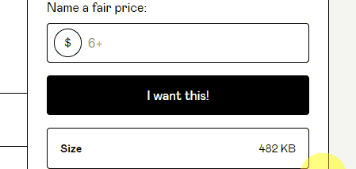
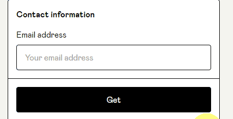
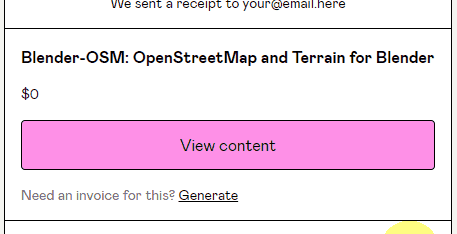
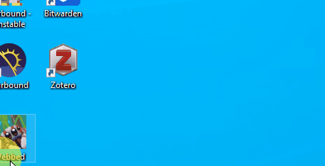
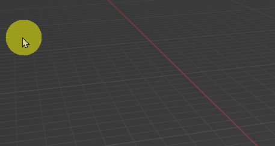
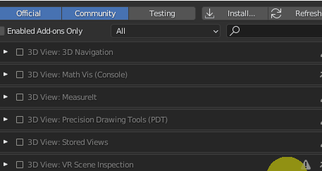

# Make a Map in Blender

Contributed by Morgan Elder 

## Description

This guide describes the download, installation, and usage of Blender-OSM in Blender. 
Blender is free and open-source software for creating 

## Requirements

- Download and install [Blender](https://www.blender.org/download/)
	- Version 3.3.1 was used in this tutorial.

## Instructions

### Downloading Blender-OSM

- Download the free Blender addon: [Blender-OSM](https://prochitecture.gumroad.com/l/blender-osm#cta)
	- Enter $0 into the price box
		- The entered amount is only a donation. Amounts greater than $0 are not required to download.
- Click "I want this"

	

- Enter your email and click "Get"

  

- Click "View Content"

- Download the "blosm" content
 

### Installing Blender-OSM in Blender

- Start the Blender application
	- For Windows, click the start icon
	- Type "Blender"
	- Click the application to start

- Open user preferences and then select Addons
	- Click Edit tab
	- Click Preferences in dropdown menu
	- Click Add-ons

- Install the addon
	- Click Install 
	- Locate and select the blosm.zip file previously downloaded
		- Check Downloads folder
	- Click Install Add-on

- Enable the addon in user preferences
	- Open again the Add-on menu in preferences
	- If not checked, click the check box next to the blender-osm addon

- Select a directory to store the 

## Sources

These resources used to create these instructions are free and publicly available.

" Create any City in Blender in 20 Minutes" - CG Geek on [YouTube](https://www.youtube.com/watch?v=NW_djQS_N8U&ab_channel=CGGeek)

